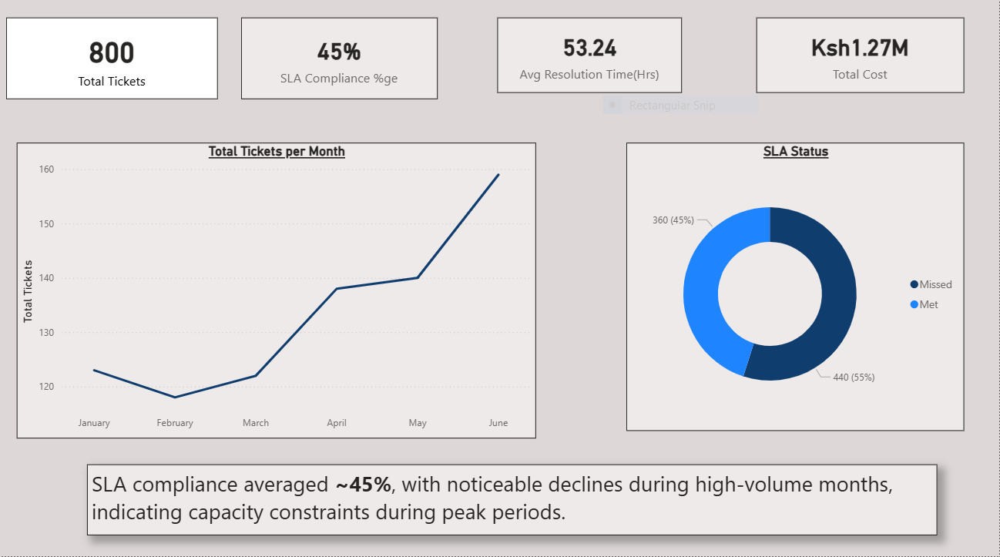
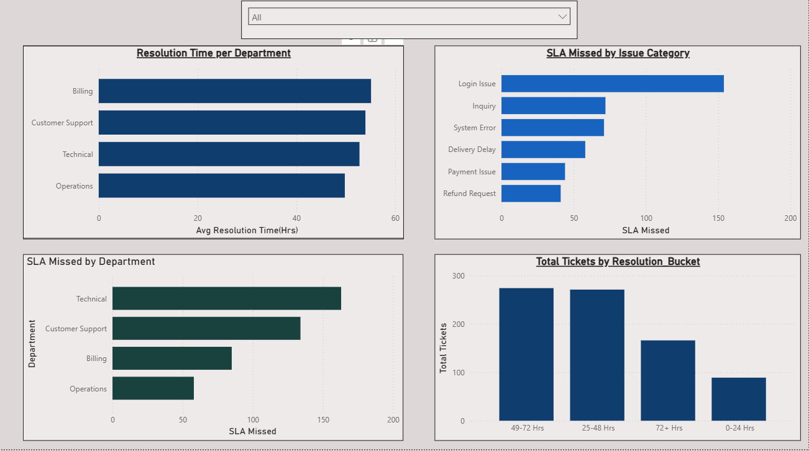
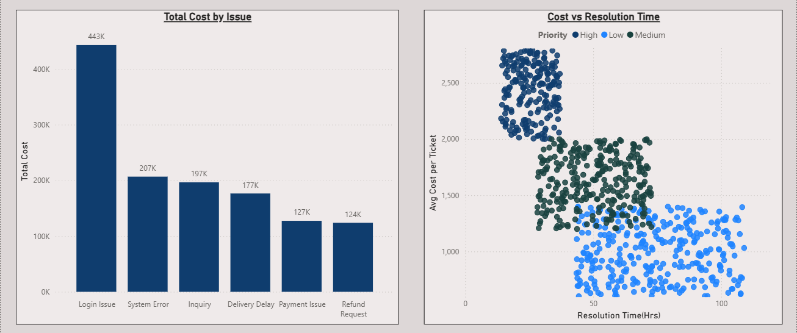

# Business & Operations Analytics Dashboard – SLA Performance Analysis

## 📊 Project Overview
This project analyses operational ticket data to evaluate SLA performance, identify bottlenecks, and uncover cost drivers. The goal is to provide actionable insights that operations leaders can use to improve efficiency, reduce SLA breaches, and optimise resource allocation.

The analysis was conducted using **Excel** for initial exploration and **Power BI** for data modelling, DAX calculations, and dashboarding.

---

## 🎯 Business Objectives
- Measure overall SLA compliance
- Identify issue categories and departments driving SLA breaches
- Analyse resolution efficiency and operational costs
- Apply Pareto analysis to prioritize high-impact problem areas
- Provide data-driven recommendations for operational improvement

---

## 🗂 Dataset
- ~800 operational tickets
- Time-based data spanning 6 months
- Multiple departments, issue categories, priorities, and agents

**Key fields include:**
- Created Date
- Resolved Date
- Department
- Issue Category
- Priority
- SLA Hours
- Cost per Ticket

Dataset available in the `data/` folder.

---

## 🛠 Tools & Technologies
- **Excel** – data exploration and validation
- **Power BI** – data modelling, DAX, and visualisation
- **DAX** – calculated columns and measures
- **GitHub** – version control and portfolio hosting

---

## 📐 Data Modeling & Calculations
Key DAX calculations include:
- Resolution Time (Hours)
- SLA Status (Met vs Missed)
- SLA Compliance %
- Monthly Trends
- Pareto-style ranking of SLA breaches by issue category

---

## 📈 Dashboard Pages

### 1️⃣ Executive Overview
High-level KPIs including SLA compliance, average resolution time, and monthly trends.

---

### 2️⃣ SLA Bottleneck Analysis (Pareto)
Identifies the issue categories responsible for the majority of SLA breaches, applying Pareto principles to prioritise operational focus.

---

### 3️⃣ Cost & Efficiency Analysis
Examines cost distribution across departments and issue categories, highlighting inefficiencies and opportunities for optimisation.

---

## 🔍 Key Insights
- SLA compliance averages approximately 45%, with noticeable declines during peak months
- A small number of issue categories account for the majority of SLA breaches
- High-priority tickets disproportionately drive operational costs
- Certain departments show consistent resolution delays, indicating process or capacity constraints

---

## ✅ Recommendations
- Prioritise process improvements in the top SLA-breaching issue categories
- Introduce workload balancing during peak demand periods
- Review escalation processes for high-priority tickets
- Monitor cost per ticket alongside SLA performance to avoid efficiency trade-offs

---

## 📁 Repository Structure
